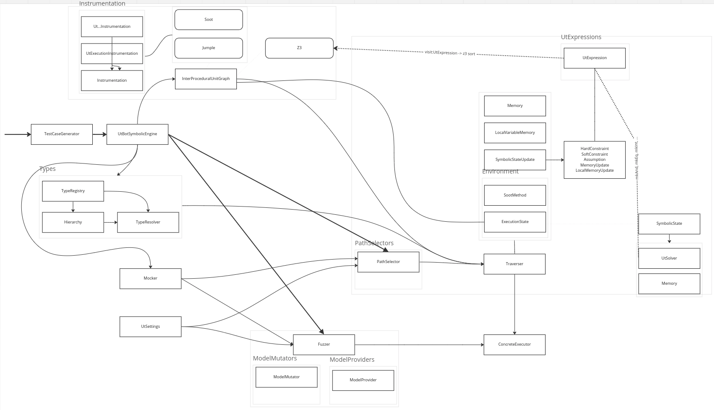

# cyber-utbot-api

## Build

Стоит склонировать и открыть этот проект, добавить `include("cyber-utbot-api")` рядом с другими `include` в `settings.gradle.kts`. После этого всё должно собраться и работать.

## Run

[Application](src/main/kotlin/org/cyber/utbot/Application.kt) - main с которого можно из кода запускать utbot и получать его ответ.

Он работает по аналогии с `utbot-cli`, в нём отдельно вынесены настройки, можно задать настройки самого utbot внутри.

Другой способ, возможно более удобный делать это через тесты [Generator](src/test/kotlin/Generator.kt), [ConstraintsViewer](src/test/kotlin/ConstraintsViewer.kt) использовался внутри для генерации тестов, оставлен для удобства.

## Docs

[brief](src/docs/brief.md) - доки по всему. Там есть описания для:
- `cyber-utbot-api` - в основном по настройкам. Не все из них проверены, но их корректность равносильна корректности `utbot-cli`
- `utbot` (стоит к ним пока что относится аккуратнее, они были написаны на тот момент без полного понимания, могут быть неточности. Доки совсем неполные и не структурированные, это всё исправится в какой-то момент)
- `abstract` - тут что-то отдельное, не относящаяся к теме, но полезное при изучении.



Схема пока в таком виде, в дальнейшем может быть стоит расписать какие-то части подробнее.

## Tests

[testcases](src/main/java/org/testcases) - папка с примерами (запускается на `utbot`)

[test](src/test/java/org/testcases) - папка с результатами запуска тестов

[testcasesGen](src/main/java/org/testcasesGen) - папка c примером в предполагаемом формате хранения.

Возможно потом стоит скомбинировать `test` и `testcasesGen`. Относительные пути во всём выше имеют общий вид.

Предполагаемый формат тестов
- Каждый файл имеют расширение `java` (пусть пока так). Содержит в себе единственный класс с единственной публичной функцией внутри (`fun`)
- Перед классом есть могут быть опциональные комментарии вида `// tag ...` и `// descriptopn ...` (первые слова зарезервированы, дальше произвольно)

Комментарии перед классов предполагается использовать в виде для хранения, по тегам можно будет искать. Теги должны обозначать что использует данный пример, что демонстрирует.

Предполагаемый формат хранения (сейчас это не совсем так):
- Все файлы лежат в одной отдельной папке
- Все файлы имеют расширение txt. (может быть стоит потом поменять)
- В начале идёт сам файл примера, его описание и теги (просто копируется текст из тестового соответствующего файла)
- После этого через разделители следует информация о сгенерированных тестах:
  - `path` - путь из `jimple` инструкций для одного теста.
  - `assertions` - ограничения для теста, полученные `utbot` после прохождения пути.
  - `assumption` - предположения для теста, полученные `utbot` после прохождения пути.
  - `lastStatus` - пока всегда `SAT` (потом стоит собирать информацию о "недогенерированных тестах", так что будет полезен).

## Tag system

Пока не придумано. Можно что-то такое, например:
- `// tag if`
- `// tag loop`
- `// tag arifmetic`

Стоит так же потом добавить параметры (например количество для `if`)

## Tests generation realization

Сейчас файлы из [testcasesGen](src/main/java/org/testcasesGen)  получаются копированием из консоли результата. Планируется это сделать более автономным и удобным.

Изменение для вывода - можно добавить в начало [UtBotSymbolicEngine](../utbot-framework/src/main/kotlin/org/utbot/engine/UtBotSymbolicEngine.kt) `consumeTerminalState`:

```kotlin
println("----------------------------------------------------------------------------------------------------")
println("path: ${state.path.joinToString(separator=",\n\t")}")
state.symbolicState.solver.apply {
    println("assertions: ${assertions.joinToString(separator=",\n\t")}")
    println("assumption: $assumption")
    println("lastStatus: $lastStatus")
}
println()
```
